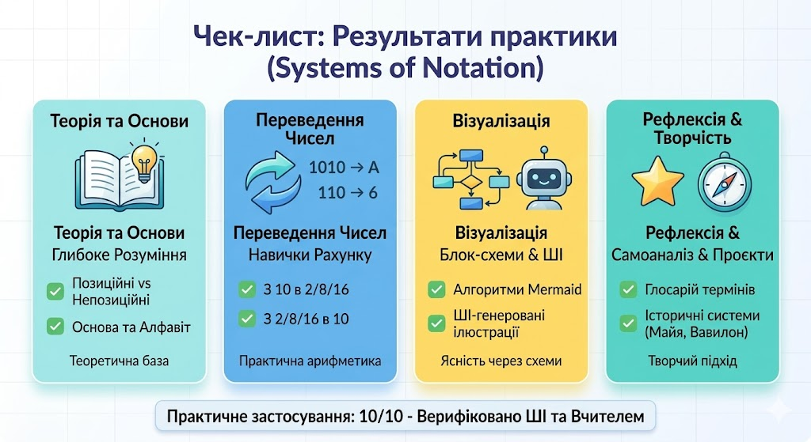

# Практичні завдання

### Рівень 1: Базовий
Переведіть числа з десяткової системи у двійкову:
1. 12
2. 45
3. 128

### Рівень 2: Просунутий
Переведіть числа з двійкової системи у десяткову:
1. 1011
2. 11001
3. 111111

### Рівень 3: Творчий
Закодуйте своє ім'я за допомогою ASCII-таблиці у шістнадцятковій системі.
